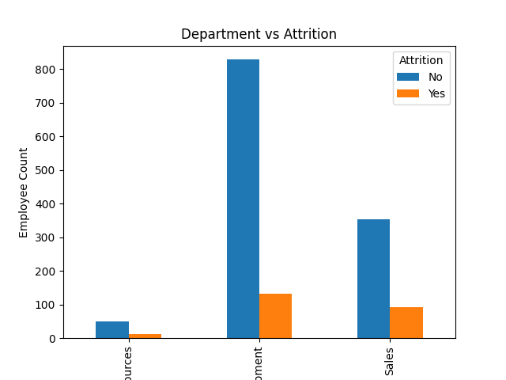
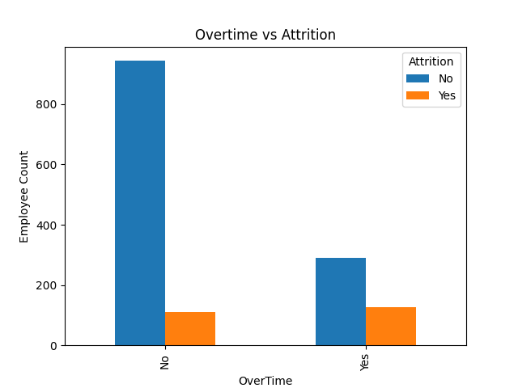
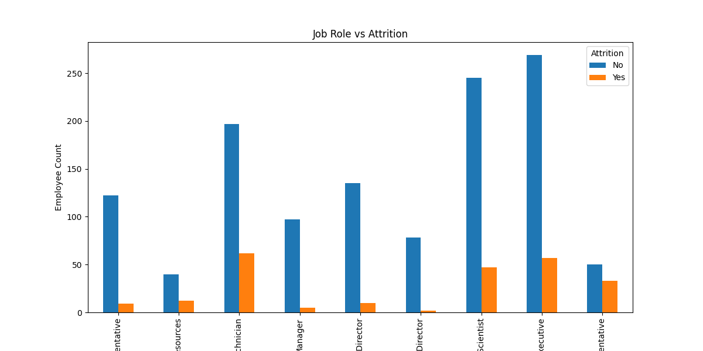

## Dataset Information

- Total Records: 1470
- Total Features: 35
- Attrition Rate: 16.12%

## Project Structure

Employee-Attrition-Analysis/
│
├── data/
│   └── emp_attrition.csv
│
├── images/
│   ├── attrition_count.png
│   ├── department_attrition.png
│   ├── overtime_attrition.png
│   └── jobrole_attrition.png
│
├── notebook/
│   └── Employee_Attrition.ipynb
│
└── README.md
# Employee Attrition Analysis

## Objective
Analyze employee attrition patterns and identify factors influencing employee turnover.

## Dataset
IBM HR Employee Attrition Dataset

- Rows: 1470
- Columns: 35

## Key Findings

### Overall Attrition
- Employees Stayed: 1233
- Employees Left: 237
- Attrition Rate: 16.12%

### Department Analysis
Research & Development had the highest number of employees and the highest attrition count.

### Overtime Analysis
Employees working overtime showed a significantly higher attrition rate compared to employees not working overtime.

### Job Role Analysis
Sales Executive, Laboratory Technician, and Research Scientist roles experienced the highest employee attrition.

## Visualizations
- Attrition Count
- Department vs Attrition
- Overtime vs Attrition
- Job Role vs Attrition

## Technologies Used
- Python
- Pandas
- Matplotlib

## Conclusion
Overtime and job role appear to be major factors influencing employee attrition. Organizations can reduce turnover by improving work-life balance and addressing role-specific concerns.
## Visualizations

### Department vs Attrition

### Overtime vs Attrition

### Job Role vs Attrition

## Model Performance

Algorithm: Random Forest Classifier

Accuracy: 87.07%

### Top Important Features

1. MonthlyIncome
2. OverTime
3. Age
4. DailyRate
5. TotalWorkingYears
6. MonthlyRate
7. EmployeeNumber
8. HourlyRate
9. DistanceFromHome
10. YearsAtCompany
## Project Structure

Employee-Attrition-Analysis/
│
├── dashboard/
├── data/
├── images/
├── notebook/
│   ├── Employee_Attrition.ipynb
│   └── attrition_model.py
├── README.md
└── .gitignore
## Technologies Used

- Python
- Pandas
- NumPy
- Matplotlib
- Scikit-Learn
- Git & Github
## How to Run

pip install pandas numpy matplotlib scikit-learn

python notebook/attrition_model.py
